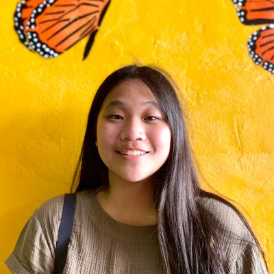

Hello there!  

I'm Samantha, a Math-Computer Science major at [UC San Diego](https://ucsd.edu/).

Interests: machine learning, artificial intelligence, software development, data visualization, markup languages, [fish](https://fis.sh/)

Email: sprestrelski \[at\] ucsd \[dot\] edu      

  

* * *
### Work Experience
**Software Engineering Intern @ ServiceNow**  
*Jun 2024 - Sep 2024*  
- Full-stack web development with React and Java on the [IntegrationHub](https://www.servicenow.com/products/integration-hub.html) Core team

**Undergraduate Researcher & Project Co-lead @ UCSD Jacobs School of Engineering**  
*Mar 2022 - Jun 2024*  
- Used [deep learning models](https://github.com/UCSD-E4E/acoustic-multiclass-training) to process avian vocalizations on the Acoustic Species Identification team, intended to measure avian biodiversity in the Peruvian Amazon
- Developed [PyHa](https://github.com/UCSD-E4E/PyHa/), a Python package to convert field audio to species-specific, temporally-labeled annotations for use in an autonomous machine learning pipeline
- Awarded Halıcıoğlu Data Science Institute [Undergraduate Research Scholarship](https://datascience.ucsd.edu/32-undergraduate-scholarships/)
- Awarded scholarship x2 times from [Summer Research Internship Program (SRIP)](https://www.ece.ucsd.edu/undergraduate/SRIP)
- Research Group: [Engineers for Exploration](https://e4e.ucsd.edu)
  - PIs: Dr. Ryan Kastner and Dr. Curt Schurgers
- Papers:  
  - J. Ayers, S. Perry, **S. Prestrelski,** T. Zhang, L. von Schoenfeldt, M. Blue, G. Steinberg, M. Tobler, I. Ingram, C. Schurgers, and R. Kastner. A Deep Learning Approach to the Automated Segmentation of Bird Vocalizations from Weakly Labeled Crowd-sourced Audio. *NeurIPS 2024 Workshop on Tackling Climate Change with Machine Learning (Spotlight Poster)*, 2024.
  - C. L. Crutchfield, K. S. Hu, V. Suresh, A. I. Perez, A. Ghosh, H. J. Grant, K. Tran, **S. Prestrelski,** R. Wallace, N. Hui, J. Elstner, D. Heppell, J. Loch, A. Candelmo, B. X. Semmens, C. Schurgers, and R. Kastner. FishSense Lite: A camera-based, single laser system for in situ fish length measurement. *Submitted for publication,* 2024.

**Web Development Intern @ RASIRC**  
*Apr 2021 - Mar 2022*  
- Redesigned [company website](https://www.rasirc.com/) and migrated it from HTML to WordPress, enabling non-technical staff to easily make website updates
- Implemented a new contact form system for requesting meetings and product information

**SONY Connected Learning Pathway**  
*Sept 2021 - Nov 2021*
- Designed software solutions for enhancing connectivity between TVs and mobile devices and integrating personalization as a core feature for TVs
- Performed market research and competitive analysis on existing technology 
- Collaboration program between UCSD Design Lab and SONY Human Factors Team

* * *

### Mentorship Experience
**Lead Peer Mentor @ CSE-PACE**  
*Sept 2023 - June 2025*  
- Lead 1-2 mentoring sessions per week on computer science topics including machine learning, AI ethics, and academic/career pathways to first year and transfer students.
- Program: [Peer-Lead Academic Cohort Experiences](https://pace.ucsd.edu/)
  
**Tutor @ UCSD CSE Department**  
*Jan 2024 - Mar 2024*
- Undergraduate tutor for CSE 105: Theory of Computation under Prof. Mia Minnes.
- Lead group office hours for up to 12 students at a time, answer student questions during lecture, help create sample solutions for the homework, and grade assignments
- [Course Website](https://theory-cs.github.io/website/courseInfo.html)

**Teaching Assistant @ COSMOS UCSD Cluster 10: Robot Inventors**  
*Jul 2023 - Aug 2023*  
- Led hands-on lab hours for 21 high school students to teach skills in mechanical design, electronics, and programming
- Advised and debugged students' week-long projects including battlebots, line-following robots, and walking robots using a Raspberry Pi and OpenCV
- Program: [COSMOS UCSD](https://jacobsschool.ucsd.edu/cosmos/clusters) 

* * *

### Websites
[**Association for Computing Machinery - AI Division**](https://ai.acmucsd.com/) -  Club website with competition portal for yearly machine learning competition.  
Stack: React, TypeScript, MongoDB, Docker, AWS  
*Sept 2023 - Jun 2025* ([Source](https://github.com/acmucsd/acm-ai-site))  

[**Nutrition Calculator API**](https://rapidapi.com/sprestrelski/api/nutrition-calculator) - API for dietary reference intakes, BMI, and daily caloric needs.  
Stack: Python, Flask  
*Jan 2024*   

[**Inclusive CS Instruction**](https://inclusivecs.github.io/) - Archive of material for CSE 191/290 Inclusive CS Instruction: CS Education From Theory To Practice.  
*Jun 2023*  

[**RASIRC**](https://www.rasirc.com/) - A company website using HTML, CSS, and Wordpress.  
*Apr 2021 - Mar 2022*  

**Rhythm Room** - A web app enabling synchronous music listening across multiple clients.   
Stack: Express, React, Node.js, Heroku, YouTube API, and Socket.io  
*Aug 2021* ([Source](https://github.com/sprestrelski/rhythm-room))  

**Overheard SPIS** - A community message posting board web app.  
Stack: Express, Heroku, and PostgreSQL     
*Aug 2021* ([Source](https://github.com/sprestrelski/overheardspis))  

[**Art Portfolio**](https://sprestrelski.weebly.com/) - A site to store my digital art work in high school using Weebly.  
*Jan 2019 - Jun 2021*

[**Internet Safety for Everyone**](https://www.isafesd.org/) - A site for an internet safety community service group using Weebly.  
*Sept 2018 - Jun 2021* 

[**CCA Girls Who Code**](http://ccagirlswhocode.weebly.com/) - A site for my high school Girls Who Code club and robotics team using Weebly.  
*Aug 2017 - Jun 2021*

* * *

### Relevant Classes
- [CSE 11: Accelerated Intro to Programming](https://ucsd-cse11-f21.github.io/syllabus.html)
- CSE 12: Basic Data Structures and Object-Oriented Design
- [CSE 15L: Software Tools and Techniques Laboratory](https://ucsd-cse15l-w22.github.io/)
    - [Lab Report Website](https://sprestrelski.github.io/cse15l-lab-reports/)
- [CSE 30: Computer Organization and Systems Programming](https://cseweb.ucsd.edu/~muller/#classes)
- CSE 100: Advanced Data Structures
- [CSE 101: Design and Analysis of Algorithms](https://cseweb.ucsd.edu/~dakane/CSE101/)
- [CSE 105: Theory of Computation](https://theory-cs.github.io/website/courseInfo.html)
- [CSE 110: Software Engineering](https://sites.google.com/ucsd.edu/cse110fall2023/home)
  - [Project Repository: PantryPal](https://github.com/sprestrelski/pantrypal)
- [CSE 130: Programming Languages: Principles and Paradigms](https://nadia-polikarpova.github.io/cse130-web/)
- CSE 140: Components and Design Techniques for Digital Systems
- CSE 140L: Digital Systems Laboratory
- CSE 141: Introduction to Computer Architecture
- [CSE 145: Embedded Systems Design Project](https://kastner.ucsd.edu/ryan/cse145/)
  - [Project Report](https://drive.google.com/file/d/1SXEis3fDLvjq8cCrmwD2GHVhplUxQ8rj/view)
  - [Project Documentation](https://github.com/UCSD-E4E/acoustic-multiclass-training/blob/main/documentation/cse_145_report.md)
- CSE 191: Inclusive CS Instruction: CS Education From Theory To Practice
  - [Archive of Seminar Material](https://inclusivecs.github.io/)
- [COGS 108: Data Science in Practice](https://github.com/COGS108)
  - [Project Report: Smog Walkability Analysis](https://github.com/sprestrelski/smog-walkability-analysis/blob/main/Report.ipynb)
- COGS 118B: Unsupervised Machine Learning
  - [Project Report: Heart Disease Prediction](https://github.com/sprestrelski/heart-disease-prediction)
- COGS 188: Artificial Intelligence Algorithms
  - [Project Report: Reinforcement Learning to Avoid Antagonistic Vehicles](https://github.com/YashPatki02/HighwayEnv-COGS188/blob/master/writeup.ipynb)
- LTCS 180: Programming for the Humanities
  - [Project Report: Multilingual Sentiment Analysis in News](https://github.com/sprestrelski/multilingual-sentiment-analysis)
- MATH 18: Linear Algebra
- MATH 20D: Differential Equations
- MATH 20E: Vector Calculus
- MATH 103AB: Abstract Algebra I & II
- MATH 109: Mathematical Reasoning
- MATH 154: Discrete Mathematics and Graph Theory
- MATH 180: Introduction to Probability
- MATH 181A: Introduction to Mathematical Statistics

Course descriptions:
- [CSE: Computer Science and Engineering](https://catalog.ucsd.edu/courses/CSE.html)
- [COGS: Cognitive Science](https://catalog.ucsd.edu/courses/COGS.html)
- [MATH: Mathematics](https://catalog.ucsd.edu/courses/MATH.html)

Updated for Fall 2024. 

- if you're researching me for a job and scrolled this far, you should consider hiring me! or at least say hello :D
- if you're one of my students, also say hello! why are you stalking me
